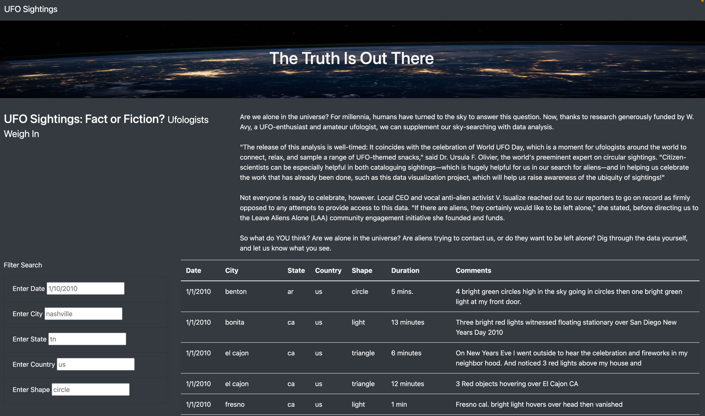
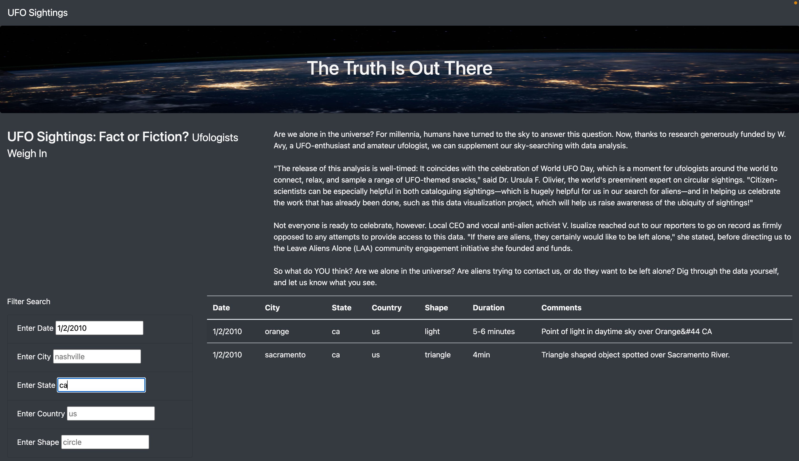
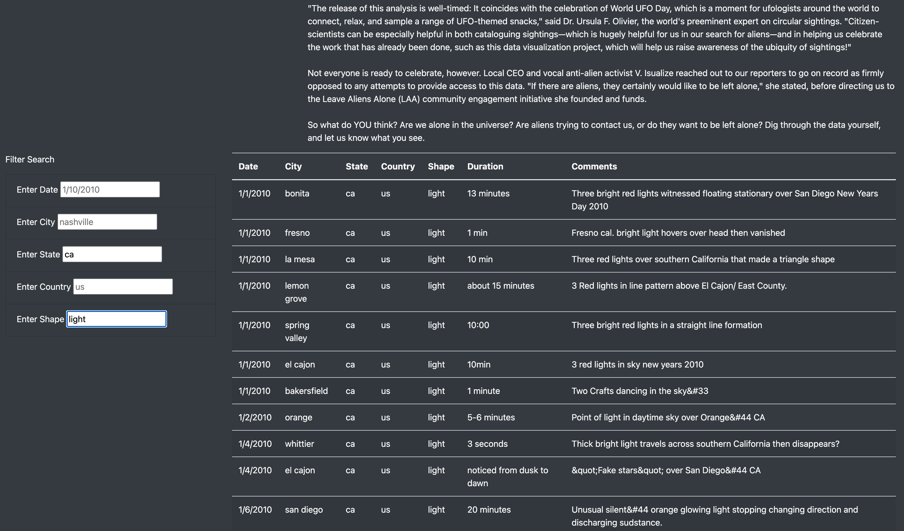

# UFOs

## Overview

Using a comprehensive list of American UFO sightings, a webpage was created that allows the user to filter this list by various attributes, such as the date of the sighting. This webpage was created using Javascript.

Do UFO sightings have credibility, or are they just a figment of one's imagination? Decide for yourself!

## Images of Webpage

### No Filter

Here is the homepage before a filter is applied. On the left, there are several search bars that enable user input. Simply type in the desired conditions and press the enter key. The page will reload with sightings that match the applied conditions.

### Webpage with Filters Applied

Below are two examples of the webpage when multiple filters are applied.

## Additional Analysis

Despite the success of the of webpage, the user has to input the relevant data in the exact format listed. For example, one must type the date in the format XX/XX/XXXX, and the state has to be two lower case letters (e.g. "ca" for California). Ideally, the webpage would filter correctly when the user types in the information in a slightly different format, (e.g. "CA" would still read like "ca"). Another issue lies with the dataset itself: the sightings are only from the year 2010 - there are many more sightings from others years that have been recorded. 

To improve this webpage, use of regular expressions could relax the formatting rules placed on the user. Also, the internet could be scraped for UFO sightings in years other than 2010. Regardless, the project was a success and sheds light on the type of UFO sightings that have been recorded.
